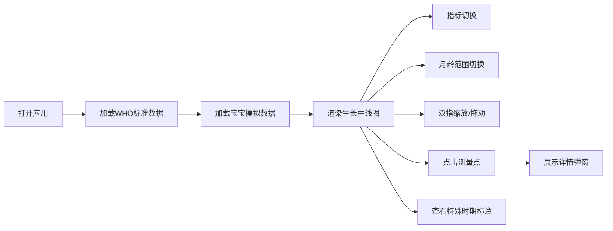

## 1. 产品概述
宝宝生长曲线交互展示H5应用，帮助家长通过手机便捷监测宝宝生长发育趋势，直观对比WHO标准数据，观察特殊时期对生长的影响。
- 核心价值：将专业的儿童生长标准转化为家长易懂的可视化工具，助力科学育儿
- 目标用户：0-5岁婴幼儿家长、育儿护理人员

## 2. 核心功能

### 2.1 用户角色
| 角色 | 注册方式 | 核心权限 |
|------|----------|----------|
| 家长用户 | 无需注册，直接使用 | 查看生长曲线、切换指标、缩放拖拽交互、查看测量详情 |

### 2.2 功能模块
1. **生长曲线展示页**：WHO标准曲线叠加、宝宝测量数据散点、生长趋势连线
2. **指标切换模块**：体重、身高、头围三种生长指标切换
3. **月龄范围切换**：0-24月和0-60月两种查看模式
4. **测量点详情弹窗**：测量数据详情、百分位计算、生长速度分析
5. **特殊时期标注**：猛长期、出牙期、生病期可视化标记

### 2.3 页面详情
| 页面名称 | 模块名称 | 功能描述 |
|----------|----------|----------|
| 主页面 | 头部信息区 | 宝宝基本信息展示、当前指标显示 |
| 主页面 | 生长曲线图 | ECharts可视化图表，支持双指缩放、左右拖动 |
| 主页面 | 指标切换栏 | 体重/身高/头围三键切换，带动画过渡效果 |
| 主页面 | 月龄切换器 | 0-24月/0-60月范围切换 |
| 主页面 | 特殊时期图例 | 展示各时期标记说明 |
| 详情弹窗 | 测量点详情 | 显示日期、月龄、数值、百分位、生长速度 |

## 3. 核心流程
用户打开应用 → 默认展示体重生长曲线（0-24月）→ 可切换指标或月龄范围 → 双指缩放查看细节 → 左右拖动浏览不同月龄段 → 点击测量点查看详情 → 观察特殊时期标注

## 4. 用户界面设计

### 4.1 设计风格
- **主色调**：柔和粉色系 `#FF8FA3`（温馨育儿感），辅助色 `#4ECDC4`（专业医疗感）
- **背景色**：渐变暖白 `#FFFAF5` 到 `#FFF5F0`，营造温暖舒适的视觉体验
- **曲线配色**：P3/P97 浅灰 `#E0E0E0`，P15/P85 中灰 `#BDBDBD`，P50 主色 `#FF8FA3`
- **宝宝数据**：鲜亮珊瑚红 `#FF6B6B` 散点 + 实线连接
- **按钮风格**：圆润胶囊型，8px圆角，微阴影，点击反馈过渡
- **字体**：使用 "PingFang SC"、"Microsoft YaHei"，数字使用等宽字体增强可读性
- **布局风格**：卡片式布局，柔和阴影，充足留白，符合移动端单手操作习惯
- **图标风格**：线性简约图标，统一2px描边

### 4.2 页面设计概述
| 页面名称 | 模块名称 | UI元素 |
|----------|----------|--------|
| 主页面 | 头部信息 | 宝宝头像、姓名、月龄展示，渐变背景，柔和阴影 |
| 主页面 | 指标切换 | 三个圆角按钮，激活态渐变填充，非激活态浅灰背景 |
| 主页面 | 图表区域 | 全宽展示，图表高度占屏幕50%，支持触摸手势 |
| 主页面 | 月龄切换 | Segmented Control 分段控件，顺滑过渡动画 |
| 主页面 | 图例区域 | 横向滚动图例，图标+文字说明 |
| 主页面 | 特殊时期标记 | 小图标标记在曲线对应位置，悬停显示说明 |
| 详情弹窗 | 弹窗内容 | 半透明遮罩，圆角卡片，关键数据大字突出展示 |

### 4.3 响应式设计
- **移动端优先**：针对320px-480px手机屏幕优化
- **触控优化**：按钮最小44x44px触控区域，滑动手势流畅响应
- **横竖屏适配**：支持横竖屏切换，图表自动调整尺寸
- **高DPI适配**：ECharts开启retina高清渲染

### 4.4 动画与交互
- 页面加载：元素淡入+上移动画， staggered 延迟效果
- 曲线渲染：数据加载后曲线逐段绘制动画
- 按钮切换：颜色渐变过渡，0.3s ease
- 弹窗：背景模糊+缩放弹出动画
- 测量点：hover/点击时缩放+发光效果
