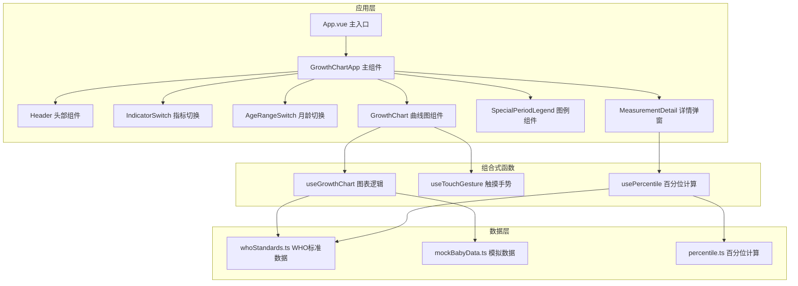

## 1. 架构设计



## 2. 技术描述

- **前端框架**：Vue 3.4+ + TypeScript 5.0+
- **构建工具**：Vite 5.0+
- **样式方案**：TailwindCSS 3.4+
- **可视化库**：ECharts 5.5+
- **初始化方式**：vite-init vue-ts 模板
- **状态管理**：Vue 3 Composition API + Vue 3 响应式系统
- **触摸交互**：原生 Touch API + 自定义手势识别

## 3. 项目目录结构

```
src/
├── components/
│   ├── Header.vue              # 头部信息组件
│   ├── IndicatorSwitch.vue     # 指标切换组件
│   ├── AgeRangeSwitch.vue     # 月龄范围切换组件
│   ├── GrowthChart.vue       # 生长曲线图主组件
│   ├── SpecialPeriodLegend.vue # 特殊时期图例
│   └── MeasurementDetail.vue # 测量详情弹窗
├── composables/
│   ├── useGrowthChart.ts     # 图表逻辑组合式函数
│   ├── useTouchGesture.ts    # 触摸手势处理
│   └── usePercentile.ts      # 百分位计算
├── data/
│   ├── whoStandards.ts       # WHO标准生长曲线数据
│   └── mockBabyData.ts      # 宝宝模拟数据
├── utils/
│   ├── percentile.ts        # 百分位计算工具
│   └── growthRate.ts          # 生长速度计算
├── types/
│   └── index.ts             # TypeScript类型定义
├── App.vue
├── main.ts
└── style.css
```

## 4. 数据模型

### 4.1 类型定义

```typescript
// 生长指标类型
type GrowthIndicator = 'weight' | 'height' | 'headCircumference'

// 月龄范围类型
type AgeRange = '0-24' | '0-60'

// 百分位类型
type Percentile = 'P3' | 'P15' | 'P50' | 'P85' | 'P97'

// WHO标准数据点
interface WHODataPoint {
  age: number           // 月龄
  P3: number
  P15: number
  P50: number
  P85: number
  P97: number
}

// 宝宝测量记录
interface BabyMeasurement {
  id: string
  date: string          // 测量日期
  ageMonths: number      // 月龄
  weight?: number          // 体重(kg)
  height?: number        // 身高(cm)
  headCircumference?: number // 头围(cm)
}

// 特殊时期类型
type SpecialPeriodType = 'growthSpurt' | 'teething' | 'illness'

// 特殊时期标注
interface SpecialPeriod {
  id: string
  type: SpecialPeriodType
  ageMonths: number
  label: string
  description: string
}

// 测量点详情
interface MeasurementDetail {
  date: string
  ageMonths: number
  value: number
  unit: string
  percentile: number
  percentileLabel: string
  growthRate: number
  growthRateUnit: string
}
```

### 4.2 WHO标准数据说明

WHO儿童生长标准基于WHO Multicentre Growth Reference Study (MGRS) 数据，包含：
- 男孩/女孩 0-60月龄体重、身高/身长、头围的百分位数值
- 精确到0.1月龄间隔的标准值
- P3, P15, P50, P85, P97 五条主百分位线

## 5. 核心功能实现方案

### 5.1 ECharts 图表配置

- **dataZoom**：支持内置型数据区域缩放，支持触屏滑动和双指缩放
- **toolbox**：隐藏，使用自定义手势替代
- **series**：
  - 5条标准曲线（line类型，平滑曲线）
  - 1条宝宝生长趋势线（line类型，带圆点标记）
  - 宝宝测量散点（scatter类型，可点击）
  - 特殊时期标注（markPoint类型）
- **tooltip**：自定义格式化，显示详细信息
- **grid**：适配移动端，边距优化
- **axis**：坐标轴自定义样式，清晰易读

### 5.2 触摸手势实现

```typescript
// 自定义触摸事件处理流程：
touchstart → 记录初始触点
touchmove → 计算移动距离和缩放比例
touchend → 判断手势类型（滑动/缩放/点击）
→ 触发相应操作
```

- 单指滑动：左右拖动图表（调用echarts.dispatchAction({ type: 'dataZoom'
- 双指捏合：缩放图表（动态调整dataZoom的start/end
- 点击测量点：触发详情弹窗（使用 echarts.on('click', handler)

### 5.3 百分位计算算法

基于LMS方法（Box-Cox幂变换）：
```
Z = ((X/M)^L - 1 / (L * S)
```
其中L=Box-Cox变换参数，M=中位数，S=变异系数

根据Z分数计算对应的百分位：
```
percentile = Φ(Z) * 100
```
Φ为标准正态分布累积分布函数

### 5.4 生长速度计算

```typescript
growthRate = (currentValue - previousValue) / (currentAge - previousAge)
```
- 体重：单位转换为g/月（kg*1000）
- 身高/头围：单位为cm/月

## 6. 性能优化策略

1. **图表懒加载：组件挂载后异步初始化ECharts实例
2. **防抖处理：resize事件防抖，避免频繁重绘
3. **数据缓存：WHO标准数据计算结果缓存
4. **按需引入：ECharts按需引入核心模块和图表类型
5. **触摸节流：touchmove事件节流，保证流畅度

## 7. 响应式适配方案

- 使用 TailwindCSS 响应式类
- viewport meta 标签设置：width=device-width, initial-scale=1.0, maximum-scale=1.0, user-scalable=no
- rem 或 vw/vh 单位适配
- ECharts 容器 resize 监听自动重绘
